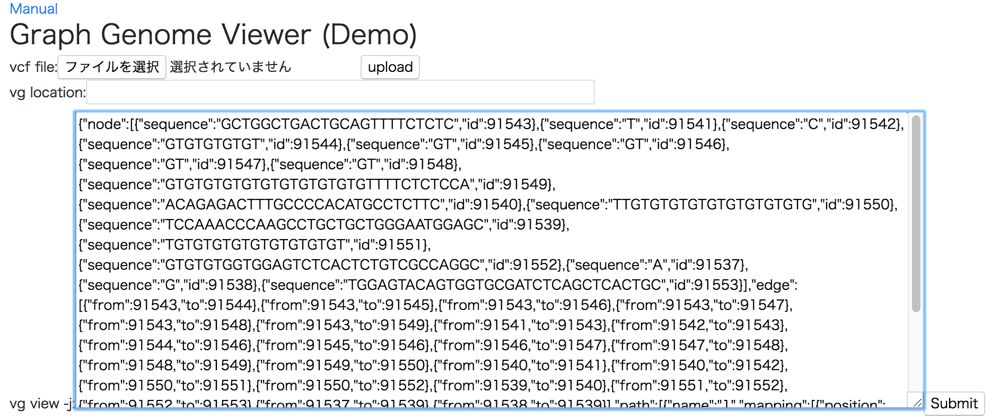

# グラフゲノムブラウザを使ってみる

グラフゲノムブラウザは、ここでは特にヒトゲノムにおける構造多型（Structural Variant）を可視化するために設計されたツールです。全ゲノムレベル、遺伝子レベルなど複数の粒度でのビューが組み合わされており、それぞれのビューで選択した変異を、複数のビューで同時に見ることができるという特徴があります。

ここでは、実際にグラフゲノムブラウザを使ってみることを通して、それぞれのビューでどのようなことができるのか、その役割を紹介したいと思います。

## 準備

まずは、このドキュメントとサンプルデータをダウンロードします。

```bash
$ git clone https://github.com/genomegraph/workshop.git
```

サンプルデータは、

```bash
$ cd browser_tutorial/
$ ls
```

で確認できます。今回はこのディレクトリにあるファイルを利用します。

## vcfファイルを可視化したい

ここでは、グラフゲノムブラウザにインテグレーションされた[vcf2ggf](https://github.com/harazon/vcf2ggf)ツールが内部で動いていることで、手元のvcfフォーマットを可視化することを試します。

### 1. vcfファイルをアップロードする 


##補遺: `vg view -j`を可視化する

上記のような一連のパイプラインによる個人ゲノムの可視化とは別に、グラフゲノムそれ自体を可視化するための簡易ビューアが用意されています。ここでは、そのビューアの使い方を紹介します。


vg_tutorialをもとに、以下のコマンドを実行します。

```bash
$ vg construct -r x.fa -v x.vcf.gz > graph.vg
$ vg view -j graph.vg  # JSON形式で標準出力する
```

出力されたjsonをクリップボードにコピーします。`pbcopy`が使える環境であれば、

```bash
$ vg view -j graph.vg | pbcopy
```

このコマンドを叩くことで、クリップボードにコピーすることができます。


[グラフゲノムブラウザ](http://graphgenome.tk/demo3/)にアクセスし、まずはブラウザの設定で画面サイズを縮小しましょう。


次に、Uploaderの`textbox` に出力されたJSONを貼り付けます。



すると、[SequenceTubeMap](https://github.com/vgteam/sequenceTubeMap), `Restricted-Layout`, `Sankey-Diagram`（後者2つはウェブ上でのグラフレンダリングを試すために実装しています）の複数の方法でレンダリングされたゲノムグラフを視覚的に確認することができます。

ところがこのままでは見にくいので、テキストボックスの`width`の値を`12800`にしてみましょう。


すると、自動的に`Restricted-Layout`, `Sankey-Diagram`でレンダリングされるグラフの幅が広がり、それぞれのビューでみやすいサイズのゲノムグラフを見ることができるようになりました。